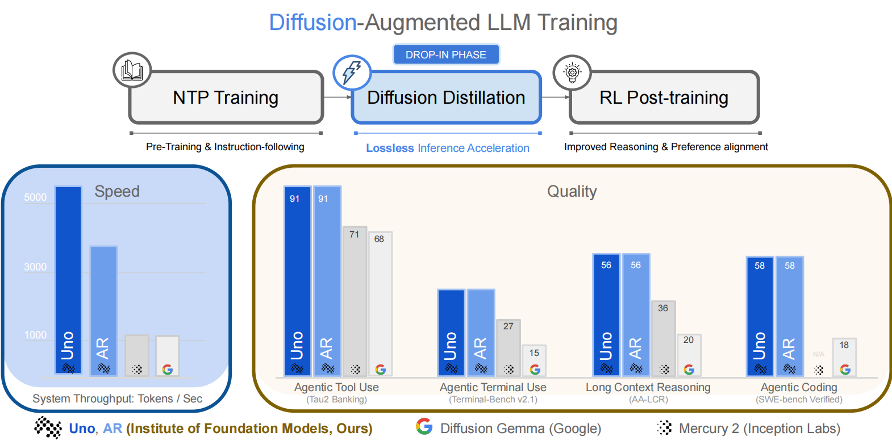

# [Uno](https://github.com/ifm-ai/uno)



[](https://arxiv.org/abs/XXXX.XXXXX)
[](https://huggingface.co/IFM/K2-Horizon-7B-Uno)
[](https://huggingface.co/IFM/K2-Horizon-0.9B-Uno)
[](https://huggingface.co/s-sahoo/uno-qwen3-8B)
[](LICENSE)

Uno is a diffusion-augmented language model with two pathways in a unified
architecture:

- The autoregressive pathway uses the base autoregressive weights.
- The diffusion pathway augments the base model with a conditional LoRA
  adapter.

Uno supports lossless speculative decoding through two $\Psi$-spec samplers:

- **Linear sampling** for high system throughput.
- **Tree sampling** for high per-request throughput.

## What This Repository Provides

- **Inference**
  - A Nano-vLLM-based inference engine shared by all Uno models.
  - Linear sampling for high system throughput.
  - Tree sampling for high per-request throughput.
  - Ready-to-run recipes for Uno Qwen3 8B, K2 Horizon 7B Uno, and K2
    Horizon 0.9B Uno.
- **Training**
  - A conditional-LoRA diffusion training pipeline for Uno Qwen3 8B.
  - OpenThoughts data preparation and progressive block-size curricula.
  - Multi-node Slurm launchers with checkpoint resume support.
- **Evaluation**
  - One shared generation and scoring pipeline across model families.
  - Benchmark-specific data loaders and graders.
  - Accuracy, tokens per forward (TPF), and tokens per second (TPS) metrics.
  - Single-benchmark, full-suite, and persistent pull-based launchers.

## Code Organization

`nano_vllm_uno` is the inference engine. The shared inference, evaluation, and
training workflows live in separate top-level modules:

```text
uno/
├── nano_vllm_uno/
│   ├── engine/                 # Scheduling, KV cache, linear and tree decoding
│   ├── layers/                 # Attention, normalization, sampling, and kernels
│   ├── models/                 # Qwen3 and K2/XLLM model implementations
│   ├── llm.py                  # User-facing generation API
│   └── sampling_params.py      # Sampling configuration
├── generation.py               # Shared generation and TPF/TPS measurement
├── inference.py                # Free-form prompt inference entry point
├── evaluation/
│   ├── run.py                  # Generate and score one benchmark
│   ├── benchmarks.py           # Canonical benchmark protocols
│   ├── data.py                 # Dataset preparation and loading
│   ├── graders/                # Math, code, MC, IFEval, LCB, LCR, and LLM judges
│   └── submit_suite.sh         # Full-suite Slurm launcher
├── training/
│   ├── train.py                # Distributed training entry point
│   ├── trainer.py              # Uno training loop
│   ├── data.py                 # Training-data pipeline
│   ├── losses.py               # CE, reverse-KL, and TV objectives
│   ├── configs/                # Curriculum and DeepSpeed configurations
│   └── run_slurm.sh            # Multi-node Slurm launcher
├── examples/
│   ├── uno_qwen3_8B/           # Training, inference, and evaluation
│   ├── uno_8B/                 # K2 Horizon 7B inference and evaluation
│   └── uno_1B/                 # K2 Horizon 0.9B inference and evaluation
├── pyproject.toml
└── README.md
```

Each directory under `examples/` supplies lightweight model defaults and calls
the same top-level workflows. Model-specific details therefore stay separate
without duplicating inference or evaluation logic.

## Getting Started

### Installation

Create a Python 3.10 environment and install Uno with its evaluation and
training dependencies:

```bash
conda create -n nano-vllm-uno python=3.10 pip -y
conda activate nano-vllm-uno

python -m pip install --upgrade pip
python -m pip install torch==2.11.0 \
  --index-url https://download.pytorch.org/whl/cu128
python -m pip install \
  'https://github.com/lesj0610/flash-attention/releases/download/v2.8.3-cu12-torch2.11/flash_attn-2.8.3%2Bcu12torch2.11cxx11abiTRUE-cp310-cp310-linux_x86_64.whl'
python -m pip install -e '.[eval,train]'
```

This installs FlashAttention-2 (FA2), which is sufficient for linear
decoding. Tree verification additionally requires FlashAttention-3 (FA3):

```bash
python -m pip install ninja==1.13.0
git clone --depth 1 --branch v2.8.3 \
  https://github.com/Dao-AILab/flash-attention.git
cd flash-attention/hopper
MAX_JOBS=16 python -m pip install --no-build-isolation .
```

### Checkpoints

| Model | Uno checkpoint | Loading layout |
| --- | --- | --- |
| K2 Horizon 7B Uno | [IFM/K2-Horizon-7B-Uno](https://huggingface.co/IFM/K2-Horizon-7B-Uno) | Base model: `IFM/K2-Horizon-7B`; Uno repository contains the conditional LoRA adapter |
| K2 Horizon 0.9B Uno | [IFM/K2-Horizon-0.9B-Uno](https://huggingface.co/IFM/K2-Horizon-0.9B-Uno) | Base model: `IFM/K2-Horizon-0.9B`; Uno repository contains the conditional LoRA adapter |
| Uno Qwen3 8B | [s-sahoo/uno-qwen3-8B](https://huggingface.co/s-sahoo/uno-qwen3-8B) | Base weights are at the repository root; the conditional LoRA adapter is under `adapter/` |

Public checkpoints can be downloaded without a Hugging Face token. A token is
still required for gated datasets such as GPQA and for any private or gated
model repository.

## Reproducing Experiments

All public model recipes live under `examples/`. Each recipe supplies the
model-specific defaults and delegates to the same shared training, inference,
or evaluation workflow.

### Training

The public training recipe currently targets Uno Qwen3 8B. K2 Horizon Uno
releases provide inference and evaluation recipes, but not K2 training
launchers.

#### 1. Prepare the Training Data

Prepare the pinned OpenThoughts3-1.2M corpus once in shared storage:

```bash
python -m training.prepare_openthoughts \
  --output /path/to/openthoughts-uno-4095 \
  --cache-dir /path/to/hf-cache \
  --num-proc 32
```

#### 2. Launch Uno Qwen3 8B Training

The following command launches the published two-node, 16-GPU,
three-epoch progressive block-size curriculum:

```bash
DATASET_PATH=/path/to/openthoughts-uno-4095 \
TRAIN_STORAGE_ROOT=/path/to/uno-training \
SLURM_ACCOUNT=my-account \
SLURM_PARTITION=my-partition \
  bash examples/uno_qwen3_8B/run_train.sh
```

The default curriculum spends half an epoch at each diffusion block size:
`2`, `4`, `6`, `8`, `12`, and `16`.

| Setting | Default |
| --- | --- |
| Global batch size | `128` |
| Learning rate | `1e-5` |
| Warmup | `562` steps, or 2% of training |
| Learning-rate decay | Disabled |
| LoRA rank | `128` |
| LoRA alpha | `2048` |
| LoRA targets | Q, K, V, O, gate, up, and down projections |
| CE weight | `0` |
| Reverse-KL weight | `0` |
| TV weight | `1` |

W&B logging is enabled by default. Run `wandb login` before training or set
`WANDB_MODE=disabled`. Set `RESUME_FROM_CHECKPOINT` and reuse the original
`RUN_NAME` to resume a run.

### Inference

Use the model recipe that matches the checkpoint. For example, run free-form
inference with Uno Qwen3 8B:

```bash
bash examples/uno_qwen3_8B/run_inference.sh \
  --prompt "Solve 2 + 2 and explain your reasoning."
```

The corresponding K2 Horizon commands use the same shared `inference.py`
workflow:

```bash
# K2 Horizon 7B Uno
bash examples/uno_8B/run_inference.sh \
  --prompt "Solve 2 + 2 and explain your reasoning."

# K2 Horizon 0.9B Uno
bash examples/uno_1B/run_inference.sh \
  --prompt "Solve 2 + 2 and explain your reasoning."
```

The example launchers use linear sampling by default. To enable tree sampling,
install FA3 and pass the tree parameters to the same entry point:

```bash
ATTENTION_BACKEND=fa3 \
  bash examples/uno_qwen3_8B/run_inference.sh \
    --prompt "Solve 2 + 2 and explain your reasoning." \
    --diffusion-block-size 16 \
    --tree-candidate-top-k 32 \
    --tree-verify-size 60
```

The command prints generated text together with output-token count, elapsed
time, TPS, decoder statistics, and TPF. Common controls include
`--temperature`, `--top-p`, `--top-k`, `--max-tokens`,
`--diffusion-block-size`, and `--max-num-seqs`.

### Evaluation

The evaluation workflow uses canonical benchmark settings from
`evaluation/benchmarks.py`. Generation and grading are separate internally,
while each model recipe runs both stages through one command.

#### 1. Prepare Evaluation Data

Missing public datasets are prepared automatically. They can also be prepared
in advance:

```bash
python -m evaluation.prepare_data \
  --output-dir /path/to/uno-eval-data
```

Accept the terms for the gated
[GPQA dataset](https://huggingface.co/datasets/Idavidrein/gpqa) and run
`hf auth login` before preparing GPQA.

> [!WARNING]
> HumanEval and MBPP grading execute model-generated Python. Run coding
> evaluations only in an isolated, secure sandbox.

#### 2. Evaluate One Benchmark

For example, generate and grade GSM8K with Uno Qwen3 8B on one GPU:

```bash
RESULTS_ROOT=/path/to/results \
DATA_PARALLEL_SIZE=1 \
  bash examples/uno_qwen3_8B/run_eval.sh gsm8k
```

Use the same interface for K2 Horizon models:

```bash
bash examples/uno_8B/run_eval.sh gsm8k
bash examples/uno_1B/run_eval.sh gsm8k
```

The available benchmark names are `aime24`, `aime25`, `aime26`,
`arc_challenge`, `gpqa_diamond`, `gsm8k`, `hle`, `humaneval`,
`ifeval`, `lcr`, `math500`, `mbpp`, and `omniscience`.

#### 3. Evaluate the Full Suite

Submit one independent Slurm job per benchmark:

```bash
MODEL_EXAMPLE=uno_qwen3_8B \
RESULTS_ROOT=/path/to/results \
SBATCH_ARGS="--account=my-account --partition=my-partition" \
  bash evaluation/submit_suite.sh
```

Set `MODEL_EXAMPLE` to `uno_qwen3_8B`, `uno_8B`, or `uno_1B`. A
persistent pull-based launcher is also available at
`evaluation/submit_pull_suite.sh`.

Canonical sampling, context, output-budget, and prompt settings are resolved by
the benchmark registry. Deliberate overrides must include
`--protocol-arm <label>`, which prevents an experimental arm from being
mistaken for a protocol-comparable result. HLE, AA-LCR, and AA-Omniscience
additionally require an external judge configured through `JUDGE_MODEL` and,
when needed, `JUDGE_BASE_URL` and `JUDGE_API_KEY`.

Each completed benchmark directory contains:

```text
generations.jsonl          # Prompts, completions, token counts, and decode stats
generation_summary.json   # Aggregate generation, TPF, and TPS metrics
grades.jsonl               # Per-sample grading records
scores.json                # Aggregate benchmark scores
```

## Acknowledgements

Uno's runtime builds on
[Nano-vLLM](https://github.com/GeeeekExplorer/nano-vllm), and its training
utilities are adapted from
[LlamaFactory](https://github.com/hiyouga/LlamaFactory). See [NOTICE](NOTICE)
for attribution and license notices.

## Citation

```bibtex
@article{uno2026,
  title   = {},
  author  = {},
  journal = {},
  year    = {2026}
}
```
